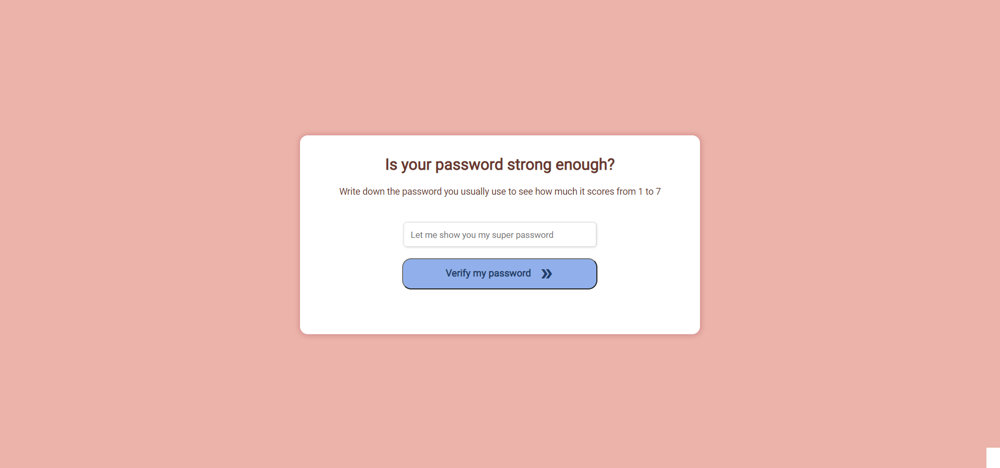

# Challenge 1 - Password scores

###### Create a program which marks passwords out of 7 using the scores table below. It should always return a number.

0. Invalid inputs.
1. Less than four characters.
2. Less than nine characters.
3. More than eight characters and all letters.
4. More than eight characters includes a number.
5. More than eight characters includes a number and special character.
6. More than twelve characters includes a number.
7. More than eight characters includes a number and special character.

###### My results:

